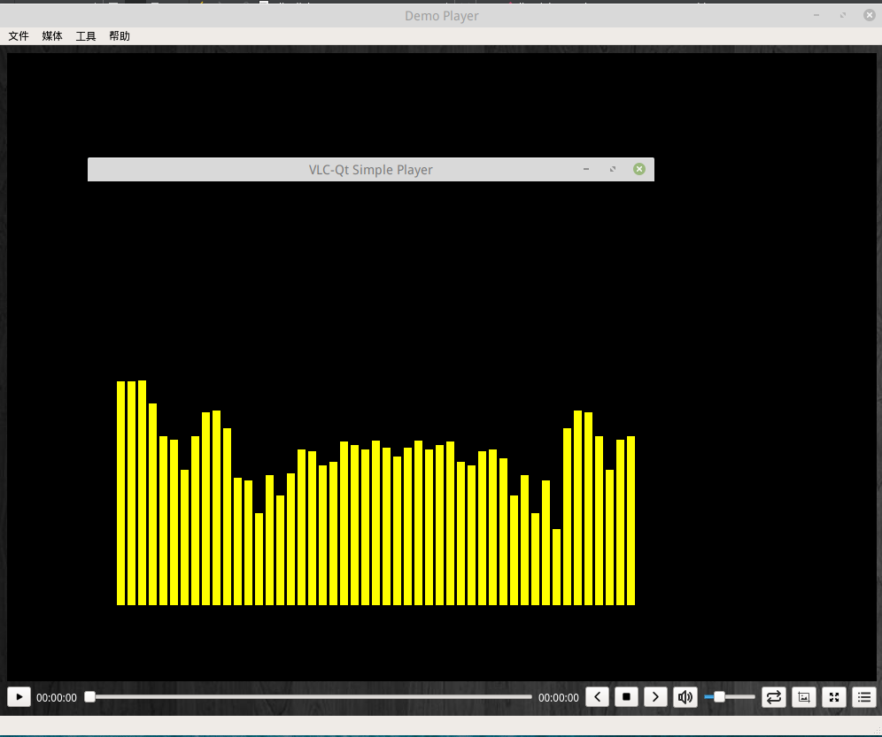

# myVLC - Linux下流媒体播放器

一个使用Qt构建的Linux下流媒体播放器

**该仓库仅仅是桌面端GUI程序，另外的简单Web管理端见：<https://github.com/YeomanLi/MediaWebsite>**

我自己测试的Linux发行版：[Ubuntu 18.10](http://www.ubuntu.org.cn/download)、[Arch Linux](https://www.archlinux.org/)


## 构建和本地调试

1. 下载配置依赖

   ```bash
   git clone git://github.com/vlc-qt/vlc-qt.git
   git submodule init
   git submodule update
   ```

   

2. 打开终端安装所有需要的.so库

   ```bash
   # Ubuntu、Debian
   $ sudo apt-get install libvlc5 libvlc-dev libvlccore-dev 
   
   # Arch、Manjaro
   $ sudo pacman -S libvlc5 libvlc-dev libvlccore-dev
   ```

   

3. 编译[vlc-qt](https://github.com/vlc-qt/vlc-qt)

   ```bash
   $ mkdir build
   $ cd build
   $ cmake .. -DCMAKE_BUILD_TYPE=Debug
   $ make -j8
   $ make install
   
   # 如果提示 permission denied 说明权限不够，需要加上 sudo 来提权
   ```

   

4. 打开自己的Qt IDE即可开始调试：）


## To-do

- [x] 基本播放
- [x] 播放控制
- [x] 精准拖动音量条、位置
- [x] 播放列表
- [x] 各种播放模式
- [x] 搜索指定文件夹下媒体文件
- [x] 全屏下动态显示播放控件
- [x] 局域网传输媒体
- [x] **实时显示音频频谱**
- [ ] 编译打包

## 简述

### 显示实时动态音乐频谱：



这个功能由于网上没有多少现成的资料供我参考，所以这个耗时很长时间，查阅了很多资料，遇到了很多坑，为了使读者能理解频谱的生成过程，这里首先介绍一下相关知识，篇幅很长，另外写了一个文档

详见：[如何实时绘制频谱](https://github.com/YeomanLi/myVLC/blob/master/spectrumanalyzer.md)

### 全屏动画

监听用户鼠标事件

### 精准拖动

重写Qt的滑动条类，监听鼠标点击事件

### 解析指定文件夹下媒体文件

首先定义一个支持的媒体格式的容器，推荐使用Set，当然Map也行，数组也OK的，接着只要递归搜索这个文件夹就行了，相关API见MDN

### 各种播放模式

为模式定义一个枚举类型：

```c++
enum PlaybackMode {
    Loop,
    Repeat,
    Shuffle,
    Order
};
Q_ENUM(PlaybackMode)
```

然后就是一些基本的逻辑了，不再赘述
